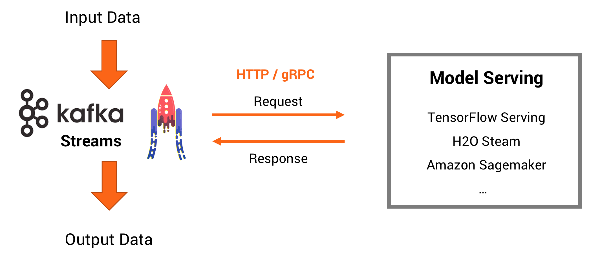

# TensorFlow Model Serving in a Kafka Streams Application
This project contains a demo to do model inference with Apache Kafka, Kafka Streams and a TensorFlow model deployed using [TensorFlow Serving](https://www.tensorflow.org/serving/) (leveraging [Google Cloud ML Engine](https://cloud.google.com/ml-engine/docs/tensorflow/deploying-models) in this example). The concepts are very similar for other ML frameworks and Cloud Providers, e.g. you could also use Apache MXNet and [AWS model server](https://github.com/awslabs/mxnet-model-server).

## Model Serving: Stream Processing vs. Request Response
Machine Learning / Deep Learning models can be used in different way to do predictions. The preferred way is to deploy an analytic model directly into a Kafka Streams application. Examples here: [Model Inference within Kafka Streams Microservices](https://github.com/kaiwaehner/kafka-streams-machine-learning-examples). However, it is not always a feasible approach. Sometimes it makes sense or is needed to deploy a model in another serving infrastructure like TF-Serving for TensorFlow models. This project shows how access such an infrastructure via Apache Kafka and Kafka Streams.

*Pros:*
- Simple integration with existing systems and technologies
- Easier to understand if you come from non-streaming world
- Later migration to real streaming is also possible

*Cons:*
- Coupling the availability, scalability, and latency/throughput of your Kafka Streams application with the SLAs of the RPC interface
- Side-effects (e.g. in case of failure) not covered by Kafka processing (e.g. Exactly Once)

## TensorFlow Serving (using Google Cloud ML Engine)
The blog post "[How to deploy TensorFlow models to production using TF Serving](https://medium.freecodecamp.org/how-to-deploy-tensorflow-models-to-production-using-tf-serving-4b4b78d41700)" is a great explanation of how to export and deploy trained TensorFlow models to a TensorFlow Serving infrastructure. You can either deploy your own infrastructure anywhere or leverage a cloud service like Google Cloud ML Engine. 

Steps to do:
1. Create Cloud ML Engine
2. Deploy prebuild TensorFlow Model
3. Create Kafka Cluster
4. Implement Kafka Streams application
5. Deploy Kafka Streams application (e.g. to a Kubernetes cluster)
6. Generate streaming data to test the combination of Kafka Streams and TensorFlow Serving
